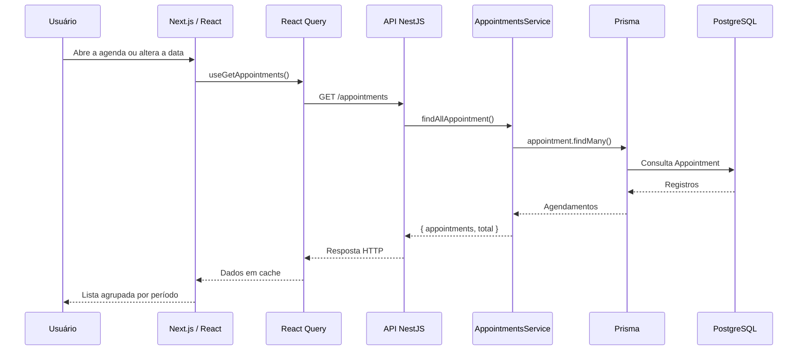

# Petshop Rocketseat

Documentação arquitetural da aplicação de petshop. Este documento existe para dar contexto a quem chega ao repositório pela primeira vez: o que o sistema faz, como o front-end e a API se relacionam, e o papel de cada pasta. Instruções de instalação e execução ficam nos `README.md` de cada aplicação, dentro de `apps/petshop` e `apps/petshop-api`.

## Sumário

1. [Visão geral do projeto](#1-visão-geral-do-projeto)
2. [Estrutura do monorepo](#2-estrutura-do-monorepo)
3. [Front-end: apps/petshop](#3-front-end-appspetshop)
4. [Back-end: apps/petshop-api](#4-back-end-appspetshop-api)
5. [Modelo de dados](#5-modelo-de-dados)
6. [API REST](#6-api-rest)
7. [Fluxo de dados e arquitetura](#7-fluxo-de-dados-e-arquitetura)
8. [Convenções do projeto](#8-convenções-do-projeto)
9. [Limites atuais da arquitetura](#9-limites-atuais-da-arquitetura)

## 1. Visão geral do projeto

O Petshop é uma aplicação de agenda para serviços destinados a pets. Atualmente, o fluxo principal permite:

- visualizar os agendamentos existentes;
- selecionar uma data para consultar a agenda;
- agrupar os atendimentos por período do dia;
- criar um novo agendamento informando tutor, pet, telefone, serviço, data e horário;
- editar os dados de um agendamento;
- excluir um agendamento;
- exibir estados de carregamento e notificações de sucesso ou erro.

O projeto é um **monorepo npm com workspaces**, organizado em duas aplicações dentro de `apps/`:

- `apps/petshop`: front-end web em Next.js;
- `apps/petshop-api`: back-end em NestJS.

A comunicação entre as aplicações acontece por uma **API REST HTTP**. O front-end usa Axios para chamar os endpoints da API, enquanto o back-end recebe as requisições por controladores NestJS e persiste os dados em PostgreSQL por meio do Prisma ORM. Não há GraphQL nem uma API interna do Next.js para os agendamentos.

## 2. Estrutura do monorepo

### Arquivos da raiz

- `package.json`: define o workspace npm, scripts compartilhados e a dependência do Turborepo.
- `turbo.json`: configura a execução coordenada de tarefas do monorepo.
- `readme.md`: este documento, com a visão arquitetural geral do repositório.
- `apps/`: reúne as aplicações independentes do produto.

```text
petshop-rocketseat/
├── apps/
│   ├── petshop/          # front-end (Next.js)
│   └── petshop-api/      # back-end (NestJS)
├── package.json
├── turbo.json
└── readme.md
```

## 3. Front-end: `apps/petshop`

### Responsabilidade

O front-end apresenta a agenda em uma interface web responsiva. Ele concentra a experiência do usuário, a composição dos formulários, o filtro visual por data e o gerenciamento do estado de cache das chamadas HTTP.

### Estrutura de pastas

```text
apps/petshop/
├── public/
├── src/
│   ├── api/
│   │   └── appointments/
│   ├── app/
│   ├── components/
│   │   ├── commons/
│   │   ├── ui/
│   │   └── utils/
│   ├── config/
│   ├── providers/
│   ├── styles/
│   ├── templates/
│   │   └── Home/
│   └── utils/
├── next.config.ts
├── tsconfig.json
├── eslint.config.mjs
└── package.json
```

#### `public/`

Armazena arquivos estáticos que podem ser servidos diretamente pelo Next.js. É o espaço destinado a imagens, fontes ou outros recursos públicos, sem passar pelo processamento dos componentes React.

#### `src/app/`

É a camada de entrada do **App Router** do Next.js.

- `layout.tsx`: layout raiz, metadados, idioma da página, `Toaster` de notificações e `QueryClientProvider`.
- `page.tsx`: rota principal, que delega a renderização para `HomePage`.

Essa camada permanece fina: regras e composição da tela ficam no template, enquanto o `app` define a entrada da aplicação.

#### `src/api/`

Centraliza o contrato de comunicação do front-end com o back-end.

- `index.ts`: exporta os recursos de API para facilitar os imports.
- `appointments/endpoints.ts`: implementa as chamadas Axios para listar, criar, atualizar e excluir agendamentos.
- `appointments/types.ts`: define os tipos `Appointment`, `CreateAppointmentType`, `UpdateAppointmentType` e os formatos de resposta.
- `appointments/hooks/`: encapsula as chamadas em hooks do TanStack React Query:
  - `useGetAppointments`: consulta e armazena a lista em cache;
  - `useCreateAppointment`: cria um registro, mostra feedback e invalida a lista;
  - `useUpdateAppointment`: atualiza um registro e sincroniza a lista;
  - `useDeleteAppointment`: exclui um registro e sincroniza a lista.

#### `src/components/commons/`

Contém componentes reutilizáveis e sem vínculo exclusivo com a tela de agenda.

- `Form/`: abstrações sobre React Hook Form, campos de texto, data, hora, área de texto e mensagens de erro.
- `Icons/`: ícones de marca e de campos, como usuário, pet, telefone, calendário, relógio e períodos do dia.
- `Main/`: container semântico para o conteúdo principal, com espaçamento padrão.
- `Text/` e `Title/`: componentes tipográficos com variantes de tamanho e estilo.

#### `src/components/ui/`

Reúne componentes de interface de uso geral, com responsabilidades visuais e de interação. Inclui botões, cards, calendário, datepicker, diálogos, popovers, área de rolagem, skeletons e componentes de alert dialog. Essas peças são usadas pelos formulários e pela agenda sem conter as regras específicas de agendamento.

#### `src/components/utils/`

Contém utilitários visuais para composição declarativa, como o componente `For`, usado para renderizar listas de forma padronizada.

#### `src/config/`

Define configurações do front-end. Inclui a instância Axios com a URL base da API e a geração das opções de horário, atualmente em intervalos de 30 minutos entre 09:00 e 21:00.

#### `src/providers/`

Abriga providers globais. `QueryClientProvider.tsx` cria o cliente do TanStack React Query e o disponibiliza para toda a árvore de componentes.

#### `src/styles/`

Centraliza os estilos globais e o ponto de exportação/importação dos estilos utilizados pelo layout do Next.js.

#### `src/templates/`

Organiza telas completas por domínio ou fluxo da aplicação.

- `Home/pages/HomePage.tsx`: compõe a tela principal, reunindo cabeçalho, agenda, lista de agendamentos e diálogo de criação.
- `Home/components/Header/`: cabeçalho da área principal e identidade visual.
- `Home/components/Agenda/`: título, descrição e seletor de data.
- `Home/components/AppointmentList/`: consulta os agendamentos, ordena por data/hora e agrupa os itens da data selecionada.
- `Home/components/AppointmentCard/`: apresenta os agendamentos de um grupo e seus dados principais.
- `Home/components/DialogAddAppointment/`: formulário de criação de agendamento.
- `Home/components/EditAppointmentDialog/`: formulário de edição, preenchido com os dados existentes.
- `Home/components/DeleteAppointmentDialog/`: confirmação e acionamento da exclusão.
- `Home/Context/DateFilterContext.tsx`: compartilha a data selecionada entre a agenda e a lista.
- `Home/schemas/`: schemas Zod e tipos inferidos para validação dos formulários no cliente.
- `Home/utils/`: funções de agrupamento, filtragem e formatação de datas e horários.
- `Home/index.ts`, `components/index.ts` e demais `index.ts`: fazem a reexportação dos módulos públicos da feature.

#### `src/utils/`

Reúne utilitários transversais, como composição de classes CSS (`cn`), leitura de variáveis de ambiente, armazenamento local e o hook `useDisclosure` para controlar diálogos.

### Tecnologias do front-end

| Categoria | Tecnologias |
| --- | --- |
| Framework | Next.js 16 (App Router), React 19, TypeScript |
| Requisições HTTP | Axios |
| Estado de servidor / cache | TanStack React Query |
| Formulários e validação | React Hook Form, Zod, `@hookform/resolvers` |
| Estilo e UI | Tailwind CSS, `tailwind-merge`, Radix UI |
| Datas e máscaras | React Day Picker, `date-fns`, React IMask |
| Ícones e feedback | Lucide React, Sonner |
| Qualidade de código | ESLint, Prettier, Husky, lint-staged |

## 4. Back-end: `apps/petshop-api`

### Responsabilidade

O back-end expõe os endpoints REST de agendamentos, valida os dados recebidos, aplica as operações de negócio do módulo e acessa o banco PostgreSQL através do Prisma.

### Estrutura de pastas

```text
apps/petshop-api/
├── prisma/
│   └── schema.prisma
├── src/
│   ├── app.controller.ts
│   ├── app.module.ts
│   ├── main.ts
│   ├── modules/
│   │   └── appointments/
│   └── prisma/
├── prisma7.config.ts
├── nest-cli.json
├── tsconfig.json
├── jest.config.ts
├── oxlint.json
└── package.json
```

#### `src/main.ts`

É o bootstrap da API. Cria a aplicação NestJS, habilita `ValidationPipe` global para os DTOs, habilita CORS e inicia o servidor na porta configurada pelo ambiente, usando `3000` como padrão.

#### `src/app.module.ts`

É o módulo raiz. Registra o `ConfigModule` global para carregar variáveis de ambiente, importa o `AppointmentsModule` e registra o controlador geral da aplicação.

#### `src/app.controller.ts`

Contém o controlador geral gerado para a aplicação. O fluxo de negócio de agendamentos fica isolado no módulo de appointments.

#### `src/modules/`

Agrupa os módulos por domínio. Essa organização permite que cada recurso tenha seu próprio módulo, controlador, serviço, DTOs e exports.

#### `src/modules/appointments/`

Implementa o domínio de agendamentos.

- `appointments.module.ts`: registra o controlador e o serviço do domínio.
- `appointments.controller.ts`: define as rotas HTTP e encaminha as operações para o serviço.
- `appointments.service.ts`: executa as operações de criação, consulta, atualização e exclusão através do Prisma.
- `dtos/`: contém `CreateAppointmentDto` e `UpdateAppointmentDto`, com regras `class-validator` para campos obrigatórios, strings e datas ISO.
- `index.ts`: facilita a exportação do módulo.

#### `src/prisma/`

Centraliza a conexão com o banco.

- `prisma.service.ts`: cria o `PrismaClient` usando o adaptador PostgreSQL (`@prisma/adapter-pg`) e a variável `DATABASE_URL`.
- `index.ts`: exporta a instância compartilhada de Prisma usada pelo serviço de agendamentos.

#### `prisma/schema.prisma`

Contém o schema do banco, detalhado na seção [Modelo de dados](#5-modelo-de-dados).

#### Arquivos de configuração

- `prisma7.config.ts`: configura o Prisma usado pelo projeto.
- `nest-cli.json`: configura o CLI e o processo de build do NestJS.
- `tsconfig.json` e `tsconfig.build.json`: definem a compilação TypeScript.
- `jest.config.ts`: configura os testes automatizados.
- `oxlint.json`: configura o lint do código do back-end.

### Tecnologias do back-end

| Categoria | Tecnologias |
| --- | --- |
| Framework | NestJS 12, Node.js, Express (`@nestjs/platform-express`) |
| Linguagem | TypeScript |
| Persistência | Prisma 7, PostgreSQL, `@prisma/adapter-pg` |
| Validação | class-validator, class-transformer |
| Configuração | ConfigModule, dotenv |
| Testes | Jest, ts-jest, Supertest |
| Qualidade de código | Oxlint, Prettier |

## 5. Modelo de dados

O sistema possui um único domínio: **agendamentos** (`Appointment`), definido em `apps/petshop-api/prisma/schema.prisma`.

| Campo | Tipo | Observações |
| --- | --- | --- |
| `id` | `UUID` | Identificador gerado automaticamente. |
| `tutorName` | `string` | Nome do tutor responsável pelo pet. |
| `petName` | `string` | Nome do pet atendido. |
| `phone` | `string` | Telefone de contato do tutor. |
| `service` | `string` | Serviço agendado (ex.: banho, tosa). |
| `date` | `string` (ISO) | Data e hora combinadas do atendimento. |

O mesmo formato de campos é usado nos DTOs do back-end (`CreateAppointmentDto`, `UpdateAppointmentDto`) e nos tipos do front-end (`Appointment`, `CreateAppointmentType`, `UpdateAppointmentType`), mantendo o contrato consistente entre as duas aplicações.

## 6. API REST

O recurso disponível é `appointments`:

| Método | Rota | Responsabilidade |
| --- | --- | --- |
| `GET` | `/appointments` | Retorna todos os agendamentos e o total de registros. |
| `POST` | `/appointments` | Cria um agendamento validado. |
| `PATCH` | `/appointments` | Atualiza um agendamento usando o `id` enviado no corpo da requisição. |
| `DELETE` | `/appointments/:id` | Remove o agendamento identificado pelo parâmetro `id`. |

> **Nota:** diferente do padrão REST mais comum, o `PATCH` não recebe o `id` na URL — ele é enviado no corpo (`body`) junto com os demais campos. Vale considerar migrar para `PATCH /appointments/:id` caso o contrato seja revisado.

O payload de criação e atualização usa `tutorName`, `petName`, `phone`, `service` e `date`. Na atualização, `id` também é obrigatório. O front-end transforma a combinação de data e hora escolhidas pelo usuário em uma string de data enviada à API.

## 7. Fluxo de dados e arquitetura

O caminho de uma consulta de agendamentos é:



Para criação, edição e exclusão, o fluxo é semelhante: o formulário valida os dados no cliente, o hook de mutação chama o endpoint correspondente e, quando a operação termina com sucesso, o React Query invalida a chave `appointments`. A próxima consulta busca os dados atualizados e a interface exibe uma notificação pelo Sonner.

O filtro de data é principalmente uma preocupação de apresentação: a API retorna a coleção completa de agendamentos, e a tela seleciona, ordena e agrupa os itens para a data escolhida.

## 8. Convenções do projeto

### Gerais

- O código é escrito em TypeScript e organizado por responsabilidade.
- Arquivos `index.ts` são usados como pontos de exportação para reduzir acoplamento aos caminhos internos.
- Os nomes de campos do domínio permanecem em inglês (`tutorName`, `petName`, `service`, `date`) tanto no front-end quanto no back-end, mantendo o contrato REST consistente.

### Front-end

- Uso de aliases de importação, como `@/api`, `@/components` e `@/templates`, para evitar caminhos relativos longos.
- Funcionalidades da interface ficam agrupadas em `templates/<Feature>`, com componentes, contexto, schemas e utilitários próximos do fluxo que os utiliza.
- Componentes genéricos ficam em `components/commons` ou `components/ui`; componentes específicos da agenda ficam em `templates/Home/components`.
- Hooks de acesso a dados seguem o padrão `use<Operação><Recurso>`, como `useGetAppointments` e `useCreateAppointment`.
- Endpoints e tipos da mesma integração são mantidos juntos em `src/api/<recurso>`.

### Back-end

- Módulos representam domínios e seguem a separação NestJS entre `module`, `controller`, `service` e `dtos`.
- Classes de DTO usam PascalCase e sufixo `Dto` (ex.: `CreateAppointmentDto`); métodos e funções usam camelCase.

## 9. Limites atuais da arquitetura

O código atual não implementa autenticação, autorização, paginação, controle de conflito de horários ou múltiplos módulos de negócio além de agendamentos. Essas capacidades podem ser adicionadas como novos módulos e contratos REST sem alterar a separação principal entre interface, API e persistência.